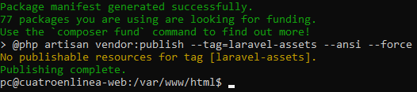
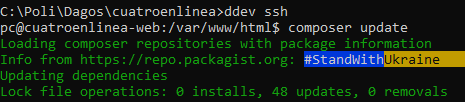

# Adaptación al Ambiente de Trabajo - cuatroenlinea

El clásico juego del "cuatro en línea". Construido en php y utilizando el framework de código abierto **Laravel**. Se juega de a dos jugadores (rojo y azul), los cuales se van turnando secuencialmente para colocar sus piezas. Gana el primer jugador en construir una línea de 4 piezas ininterrumpida. 

## Prerrequisitos
Se necesitan tener previamente las siguientes aplicaciones instaladas.
- DDEV (https://ddev.readthedocs.io/en/stable/)
- Docker Desktop (https://docs.docker.com/desktop/)
- Composer (https://getcomposer.org/download/)

Junto a ellas, se indican los enlaces a la documentación oficial de cada una.

 

## Preparación del proyecto
Previamente a correr el proyecto, se deben configurar e instalar todas las dependencias necesarias.

### 1- Creación de container (entorno de trabajo)
- Abrimos la aplicación de `Docker Desktop`, y posteriormente ejecutamos en la consola la siguiente orden:

> ``ddev config``

Con la cual podremos configurar el contenedor de Docker en el cual se alojará la aplicación. Los campos a informar son: nombre de proyecto (arbitrario), la ruta del documento raíz del proyecto (usualmente se deja el campo vacío) y el tipo de proyecto (el cual **debe** ser laravel).

Una vez tengamos eso configurado, lo podremos inicializar:

> ``ddev start``

 

### 2- Verificación con composer

`Composer` es el gestor de dependencias encargado de php. Tenemos que asegurarnos de tener todos los paquetes actualizados a la fecha. Para ello, primero nos conectaremos al servidor local y luego verificaremos que esté actualizado con los siguentes comandos:

> ``ddev ssh`` y ``composer update``

 

### 3- Crear archivo de ambiente

Un paso importante por hacer previo a intentar correr la aplicación es crear el archivo de ambiente del proyecto, aka ``.env``. La mayoría del contenido de este ya está incluido en ``.env.example``. Sin embargo, le agregaremos dos líneas adicionales para garantizar los permisos de ejecución necesarios durante la ejecución de ``laravel/sail``. Para hacerlo utilizaremos los siguientes comandos:

> ``ls -la``
> ``cp .env.example .env ``
>``echo "WWWGROUP=1000" >> .env``
>``echo "WWWUSER=1000" >> .env``

Con estas 4 líneas nos ahorraremos algunos errores de código https 500 al querer ejecutar laravel/sail.